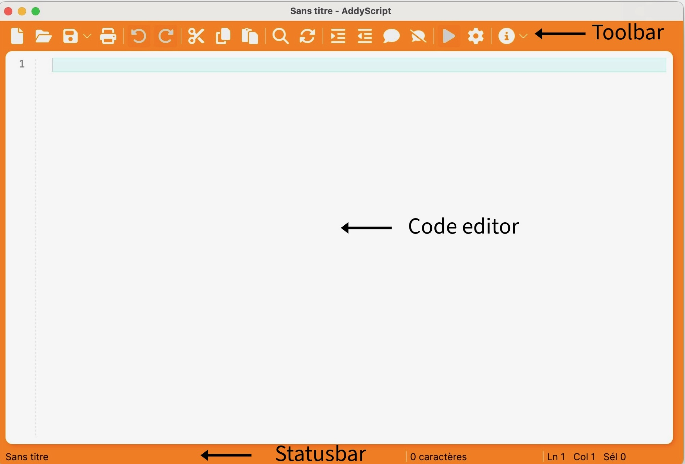
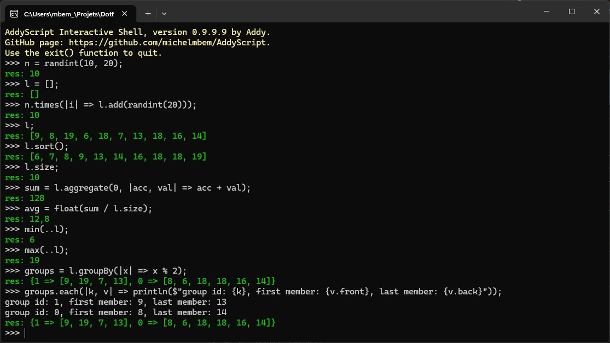

# Using the graphical editor and the command line interface

AddyScript comes with a graphical script editor and an interactive console.
These two tools allow you to quickly write and test your own scripts.
I will try to explain in the following lines how to use them.

## Using the graphical script editor

The AddyScript Graphical User Interface (**asgui**) is an [Avalonia UI](https://avaloniaui.net/) application built around the [AvaloniaEdit](https://github.com/AvaloniaUI/AvaloniaEdit) control.
It offers useful features such as syntax highlighting, automatic indentation, call tips, code completion and code snippets insertion.
Its use of the [Avalonia UI](https://avaloniaui.net/) toolkit ensures compatibility with most operating systems and desktop environments.
Upon opening, it appears as a single window with a toolbar at the top, a text area (or code editor) in the middle, and a status bar at the bottom.
The following image illustrates the GUI window:



### Editor toolbar's buttons:

From left to right, the toolbar buttons play the following role:

1. **New**: Creates a new window with an empty text box to allow you to edit a brand-new script.
2. **Open**: Displays a file selection dialog and allows you to open an existing script in the active window if it was still empty or in a new window if it was not.
3. **Save**: Saves the currently edited script to a file. The associated drop-down menu allows you to save the script under a new name or keep the existing name (if the currently edited script was already saved).
4. **Print**: Prints the currently edited script. This actually exports the script as a PDF document that is then sent to the printer using a system command. There is an option in the associated dropdown menu to save the generated PDF document in a local file for later printing.
5. **Undo**: Undoes the last action.
6. **Redo**: Reapplies the last undone action.
7. **Cut**: Cuts the selected text to the clipboard.
8. **Copy**: Copies the selected text to the clipboard.
9. **Paste**: Pastes the clipboard contents into the editor.
10. **Find**: Displays the Find/Replace dialog with the "Find" tab enabled.
11. **Replace**: Displays the Find/Replace dialog with the "Replace" tab enabled.
12. **Indent**: Increases the indentation level of the selected lines of code.
13. **Outdent**: Decreases the indentation level of the selected lines of code.
14. **Comment Lines**: Comments out the selected lines of code.
15. **Uncomment Lines**: Uncomment the selected lines of code.
16. **Run**: Launches a console window and interprets the script being edited.
17. **Configure**: displays a dialog box in which the user can set options such as the list of directories in which imported scripts should be searched or the list of assemblies referenced by the script.
18. **Help**: displays this manual. Another entry in the drop-down menu displays the about box.

### General editor tips:

1. **asgui** does not execute scripts by itself. It delegates this task to **asis**. Therefore, the executables of both programs must always be in the same directory.
2. To have time to read the output printed by your script, always add a call to the _readln()_ function at the end of it. Of course this is not necessary for scripts that have a graphical interface.
3. The shortcut to execute a script is **[F5]**. In fact, many commands use the same shortcut as in VS:
    1. **[Ctrl+N]** to create a new script
    2. **[Ctrl+O]** to open an existing script
    3. **[Ctrl+S]** to save the current script (**[Ctrl+Shift+S]** for saving to a different name)
    4. **[Ctrl+P]** to print it (**[Ctrl+Shift+P]** to save as PDF)
    5. **[Ctrl+F]** to open the search window in find mode
    6. **[Ctrl+H]** to open the search window in replace mode
    7. **[F1]** to display help
    8. The **[Tab]** key increases the indentation of selected lines
    9. Combined with the **[Shift]** key it decreases the indentation level instead
    10. **[Ctrl+K]** comments out selected lines
    11. **[Ctrl+Shift+K]** uncomments selected lines
    12. **[Ctrl+I]** inserts a code snippet
    13. **[Ctrl+Shift+I]** surrounds the selection with a code snippet
4. On macOS all the above commands use the **[Command]** key in place of **[Ctrl]**.
5. Additional commands are available in the editor's context menu.

## Using the Interactive Console

It may seem natural for a scripting language to have an interactive console. AddyScript adheres to this principle by providing a _REPL_ interface called **asis** (for AddyScript Interactive Shell). Now, it's not as sophisticated as those of more mature languages (indeed, AddyScript is under construction, right?) but it does the essentials: read your commands, parse them, and interpret them. Here's an illustration of what it looks like:



Using the console is simple, just type a command and press [Enter]. Remember to add a semicolon at the end of each statement, except for blocks (this may seem strange if you are familiar with scripting languages, but currently AddyScript really expects a semicolon at the end of each statement. This behavior will probably change in the future).

### Troubleshooting with the if-else statement:

Suppose you want to enter a sequence of statements like this:

```JS
a = randint(10);
if (a > 5)
    println('Greater than five');
else
    println('Less than or equal to five');
```

You'll start by typing the first three lines. But as soon as AddyScript encounters the semicolon at the end of the third line, it assumes your if-else statement is complete, throwing an error when it encounters the next **else** (of course, no statement in AddyScript begins with the keyword **else**). To solve this problem, I recommend that you always use curly braces when typing an if-else statement. In particular, be sure to always place your **else** keyword between the closing brace of the **if** block and the opening brace of its own block. If you do this, the previous example would look like this:

```JS
a = randint(10);
if (a > 5) {
    println('Greater than five');
} else {
    println('Less than or equal to five');
}
```
Another option is to type the whole if-else statement in a single line of code, if it's short enough.

### Command line options for asis:

Actually, you don't have to run **asis** in interactive mode. Depending on the parameters you pass to it, it can behave differently. Here is a table summarizing the **asis** command line options and their meaning:

| Option              | Description                                                                                                                                                                                                                                                                                                                                                                                                 |
|---------------------|-------------------------------------------------------------------------------------------------------------------------------------------------------------------------------------------------------------------------------------------------------------------------------------------------------------------------------------------------------------------------------------------------------------|
| -i                  | Tells that we want to run asis in interactive mode. Not required since that's the default behaviour of asis. This option can figure at most one time in the command line and cannot be mixed with -e and -f.                                                                                                                                                                                                |
| -e expression       | Tells that we just want asis to evaluate the given expression and return after displaying the result to the standard output. This option can figure at most one time in the command line and cannot be mixed with -i and -f. Argument expression may contain several expressions separated by semi-columns. In that case, all expressions are evaluated but only the result of the last one is printed out. |
| -f path/to/script   | Tells that we want asis to parse and run the script stored in the file pointed to by the given path. This option can figure at most one time in the command line and cannot be mixed with -i and -e.                                                                                                                                                                                                        |
| -d directory-name   | Tells asis to add the given directory to the SearchPath property of its internal instance of ScriptContext so that imported scripts would be searched in that directory. This option can figure zero, one or several times (with different directory names) in the command line.                                                                                                                            |
| -r assembly-name    | Tells asis to add the so called assembly to the References property of its internal instance of ScriptContext so that .NET types would be searched in that assembly. This option can figure zero, one or several times (with different assembly names) in the command line.                                                                                                                                 |
| -l path/to/log/file | Tells asis where to report the errors that may occur during the execution of a script. This option can figure at most one time in the command line and is more useful when combined with the -f option.                                                                                                                                                                                                     |
| -c culture-name     | Tells asis to use a specific culture while running a script. 4 cultures are supported at this stage: English (the default), French, Spanish and Portuguese. If not specified, the default UI culture of the current OS user will be used. This option can figure at most one time in the command line and can be combined with any other option.                                                            |

Here are some useful examples of how to invoke asis:

* Simple interactive mode: `asis`
* Just run the _test5.add_ file: `asis -f test5.add`
* Run _test5.add_ using the _es_ (Spanish) culture and writing logs in _test5.log_: `asis -f test5.add -l test5.log -c es`
* Evaluate an expression: `asis -e "x = 10; y = 5; 2*x - 5*y + 3"`.

    Output:

    ```
    -2
    ```

* Interactive mode with reference to some common .NET assemblies; imported scripts should be looked for in the provided _samples/library_ directory: `asis -r System.Data.OleDb -r System.Windows.Forms -d ../../../samples/library`.

* Run the _test5.add_ file with references to some common .NET assemblies; imported scripts should be looked for in the provided _samples/library_ directory: `asis -f test5.add -r System.Data.OleDb -r System.Windows.Forms -d ../../../samples/library`

## Conclusion

Well, that's it. More features will be added to both tools in the future. But for now, I hope they do the basics.

<div markdown class="web-only">

[Home](README.md) | [Previous](scriptengine.md) | [Next](anatomy.md)

</div>