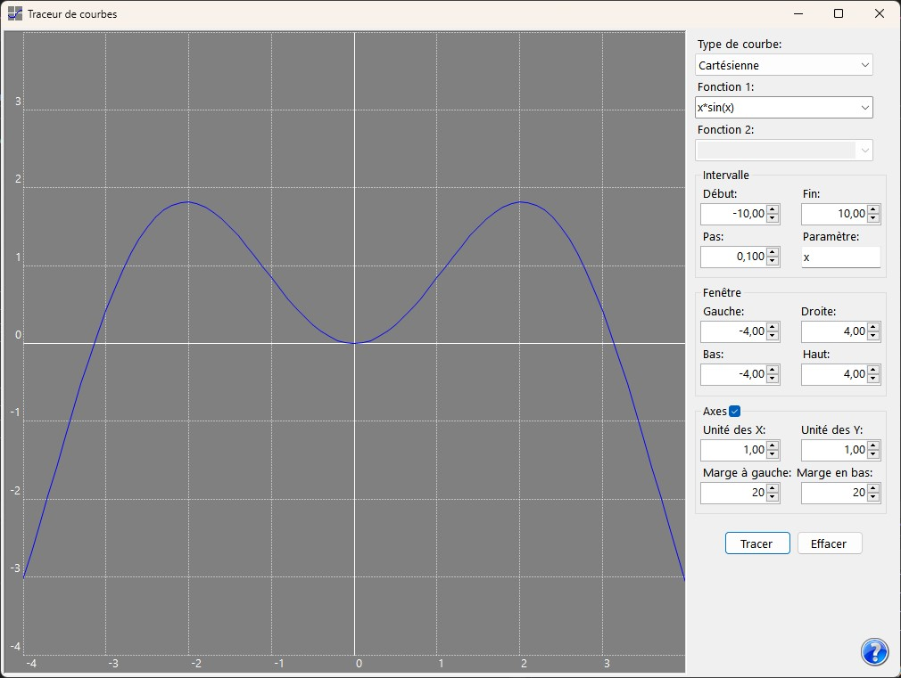

# Evaluating expressions

### The simpler approach 

To evaluate an expression with AddyScript, just proceed as follows: 

1. Type the expression in an editor (here I suppose that the editor is a TextBox control named _txtExpr_).  
2. Add a reference to AddyScript.dll in your project.  
3. Create a GUI in your project to allow the user to invoke the scripting engine.  
4. In your code file import the AddyScript namespace.  
5. You could import any additional namespace from the AddyScript assembly depending on what you intend to do.  
6. Finally, type a code snippet like the following one in an event handler:  

```CSharp
var context = new ScriptContext();  
context.Bindings["myString"] = "Hello!";  
context.Bindings["myFloat"] = 0.9;  
var result = ScriptEngine.EvaluateString(txExpr.Text, context);  
Console.WriteLine($"Given {context.Bindings["myString"]} and {context.Bindings["myFloat"]}, we obtain {result}");  
```

**Remark:** Don't forget to embed this code in a try-catch block. 

### Parsing once, running later 

Below is another example in which the expression is parsed once and evaluated several times in a loop. Before testing it, you should create the GUI and provide the logic of _MoveTo_ and _LineTo_ methods yourself: 

```CSharp
// txtFunction is a TextBox in which the user types the expression.
// A single parameter named 'x' is expected.
var expression = ScriptEngine.ParseExpression(txtFunction.Text);
var context = new ScriptContext();

// txtFrom, txtTo and txtBy are TextBoxes in which the user types the plotting range.
double start = double.Parse(txtFrom.Text);
double end = double.Parse(txtTo.Text);
double step = double.Parse(txtBy.Text);

// Determine the initial point and move the graphical cursor there.
double x = start;
context.Bindings["x"] = x;
double y = ScriptEngine.Evaluate(expression, context).AsDouble;
MoveTo(x, y);

// Plot the curve segment by segment.
do
{
    x += step;
    context.Bindings["x"] = x;
    y = ScriptEngine.Evaluate(expression, context).AsDouble;
    LineTo(x, y);
 } while (x < end);
```

This example is very similar to what is done in the AddyScript Plotter's (**asplot**) source code, a demonstrative tool that is shipped with the scripting engine and could be used for real life plotting needs. Here is a snapshot of it: 

