# AddyScript grammar

The following railroad diagrams summarize the syntax of the AddyScript language. They were generated with the help of a tool called [_Railroad Diagram Generator_](https://rr.red-dove.com/ui). Thanks to the authors!

Note that in the AddyScript grammar, the axiom is a symbol called _Program_ ; it represents an entire script. Here are the syntax rules:

<style>
    img {
        background-color: #FFE;
        padding: 8px;
    }
</style>

## Non-terminal symbols

**Program:**


```
Program  ::= StatementSeries
```

**StatementSeries:**


```
StatementSeries ::= ( Label* Statement )*
```

**Label:**


```
Label ::= IDENTIFIER ':'
```

**Statement:**


```
Statement
         ::= ImportDirective
           | ClassDefinition
           | FunctionDecl
           | ExternalFunctionDecl
           | ConstantDecl
           | VariableDecl
           | Block
           | IfElse
           | SwitchBlock
           | ForLoop
           | ForEachLoop
           | WhileLoop
           | DoLoop
           | Continue
           | Break
           | Goto
           | Return
           | Throw
           | TryCatchFinally
           | Expression ';'
```

**ImportDirective:**


```
ImportDirective ::= 'import' QualifiedName ( 'as' IDENTIFIER )? ';'
```

**QualifiedName:**


```
QualifiedName ::= IDENTIFIER ( '::' IDENTIFIER )*
```

**ClassDefinition:**


```
ClassDefinition ::= Attributes? MODIFIER? 'class' IDENTIFIER ( ':' IDENTIFIER )? '{' ClassMember* '}'
```

**Attributes:**


```
Attributes ::= '[' Attribute ( ',' Attribute )* ']'
```

**Attribute:**

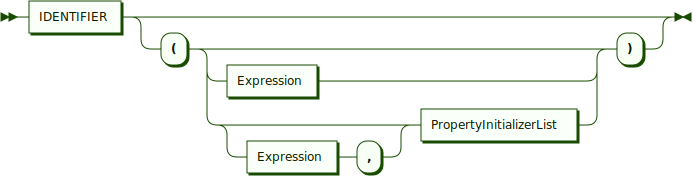

```
Attribute ::= IDENTIFIER ( '(' ( Expression | ( Expression ',' )? PropertyInitializers )? ')' )?
```

**PropertyInitializers:**


```
PropertyInitializers ::= PropertyInitializer ( ',' PropertyInitializer )*
```

**PropertyInitializer:**


```
PropertyInitializer ::= IDENTIFIER '=' Expression
```

**ClassMember:**


```
ClassMember ::= MemberPrefix? MemberSpec
```

**MemberPrefix:**


```
MemberPrefix
         ::= SCOPE ( MODIFIER Attributes? | Attributes MODIFIER? )?
           | MODIFIER ( SCOPE Attributes? | Attributes SCOPE? )?
           | Attributes ( SCOPE MODIFIER? | MODIFIER SCOPE? )?
```

**MemberSpec:**


```
MemberSpec
         ::= ConstructorSpec
           | FieldSpec
           | PropertySpec
           | MethodSpec
           | EventSpec
```

**ConstructorSpec:**

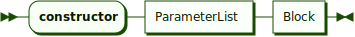

```
ConstructorSpec ::= 'constructor' ParameterList Block
```

**FieldSpec:**


```
FieldSpec ::= IDENTIFIER ( '=' Expression )? ';'
```

**PropertySpec:**


```
PropertySpec ::= 'property' PropertyName ( ExpandedPropertySpec | AutoPropertySpec )
```

**PropertyName:**


```
PropertyName ::= IDENTIFIER | '[]'
```
<sub>**Remark**: the property is an indexer when its name is a pair of brackets</sub>

**ExpandedPropertySpec:**


```
ExpandedPropertySpec
         ::= '=>' Expression ';'
           | '{' ( SCOPE? ( 'read' | 'write' ) FunctionBody )+ '}'
```
<sub>**Remark**: each accessor can only be defined once</sub>

**FunctionBody:**


```
FunctionBody
         ::= '=>' Expression ';'
           | Block
```

**AutoPropertySpec:**


```
AutoPropertySpec
         ::= '{' ( SCOPE? ( 'read' | 'write' ) ';' )+ '}'
           | ';'
```
<sub>**Remark**: each accessor can only be declared once</sub>

**MethodSpec:**


```
MethodSpec
         ::= AbstractMethodSpec
           | StandardMethodSpec
           | OperatorSpec
```

**AbstractMethodSpec:**


```
AbstractMethodSpec ::= 'function' IDENTIFIER ParameterList ';'
```

**StandardMethodSpec:**


```
StandardMethodSpec ::= 'function' IDENTIFIER ParameterList FunctionBody
```

**OperatorSpec:**


```
OperatorSpec ::= 'operator' OverloadableOperator ParameterList FunctionBody
```

**ParameterList:**


```
ParameterList ::= '(' ( Parameter ( ',' Parameter )* )? ')'
```

**Parameter:**


```
Parameter ::= ParameterPrefix IDENTIFIER | IDENTIFIER ( '=' Literal )?
```

**ParameterPrefix:**


```
ParameterPrefix ::= 'ref' | 'params'
```

**OverloadableOperator:**


```
OverloadableOperator
         ::= '+'
           | '-'
           | '++'
           | '--'
           | '~'
           | '*'
           | '/'
           | '%'
           | '**'
           | '&'
           | '|'
           | '^'
           | '<<'
           | '>>'
           | '=='
           | '!='
           | '<'
           | '>'
           | '<='
           | '>='
           | 'startswith'
           | 'endswith'
           | 'contains'
           | 'matches'
```

**EventSpec:**


```
EventSpec ::= 'event' ParameterList ';'
```

**FunctionDecl:**


```
FunctionDecl ::= Attributes? 'function' IDENTIFIER ParameterList FunctionBody
```

**ExternalFunctionDecl:**

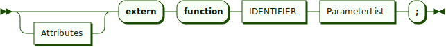

```
ExternalFunctionDecl ::= Attributes? 'extern' 'function' IDENTIFIER ParameterList ';'
```

**ConstantDecl:**


```
ConstantDecl ::= 'const' PropertyInitializers ';'
```

**VariableDecl:**

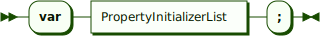

```
VariableDecl ::= 'var' PropertyInitializers ';'
```

**Block:**


```
Block ::= '{' StatementSeries '}'
```

**IfElse:**

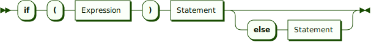

```
IfElse ::= 'if' '(' Expression ')' Statement ( 'else' Statement )?
```

**SwitchBlock:**


```
SwitchBlock ::= 'switch' '(' Expression ')' '{' ( CaseLabel StatementSeries )+ '}'
```

**CaseLabel:**

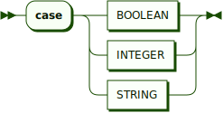

```
CaseLabel ::= ( 'case' ( BOOLEAN | INTEGER | STRING ) | 'default' ) ':'
```

**ForLoop:**


```
ForLoop ::= 'for' '(' ( VariableDecl | ExpressionList )? ';' Expression? ';' ExpressionList? ')' Statement
```

**ExpressionList:**


```
ExpressionList ::= Expression ( ',' Expression )*
```

**ForEachLoop:**

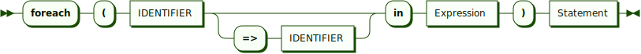

```
ForEachLoop ::= 'foreach' '(' IDENTIFIER ( '=>' IDENTIFIER )? 'in' Expression ')' Statement
```

**WhileLoop:**


```
WhileLoop ::= 'while' '(' Expression ')' Statement
```

**DoLoop:**


```
DoLoop ::= 'do' Statement 'while' '(' Expression ')' ';'
```

**Continue:**

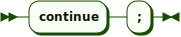

```
Continue ::= 'continue' ';'
```

**Break:**


```
Break ::= 'break' ';'
```

**Goto:**


```
Goto ::= 'goto' IDENTIFIER ';'
```

**Return:**

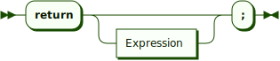

```
Return ::= 'return' Expression? ';'
```

**Throw:**


```
Throw ::= 'throw' Expression ';'
```

**TryCatchFinally:**


```
TryCatchFinally ::= 'try' ( '(' Expression ')' )? Block ( 'catch' '(' IDENTIFIER ')' Block )? ( 'finally' Block )?
```

**Expression:**

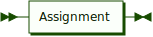

```
Expression ::= Assignment
```

**Assignment:**


```
Assignment ::= TernaryExpression ( AssignmentOperator Assignment )*
```

**AssignmentOperator:**


```
AssignmentOperator
         ::= '='
           | '+='
           | '-='
           | '*='
           | '/='
           | '%='
           | '**='
           | '&='
           | '|='
           | '^='
           | '<<='
           | '>>='
           | '??='
```

**TernaryExpression:**

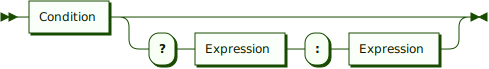

```
TernaryExpression ::= Condition ( '?' Expression ':' Expression )?
```

**Condition:**


```
Condition ::= Relation ( LogicalOperator Relation )*
```
<sub>**Remark**: associativity to the left</sub>

**LogicalOperator:**

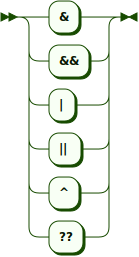

```
LogicalOperator
         ::= '&'
           | '&&'
           | '|'
           | '||'
           | '^'
           | '??'
```

**Relation:**

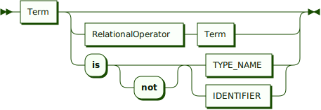

```
Relation ::= Term ( RelationalOperator Term | 'is' ( TYPE_NAME | IDENTIFIER ) )?
```

**RelationalOperator:**


```
RelationalOperator
         ::= '=='
           | '!='
           | '<'
           | '>'
           | '<='
           | '>='
           | '==='
           | '!=='
           | 'startswith'
           | 'endswith'
           | 'contains'
           | 'matches'
```

**Term:**


```
Term ::= Factor ( ( '+' | '-' ) Factor )*
```
<sub>**Remark**: associativity to the left</sub>

**Factor:**


```
Factor ::= Exponentiation ( ( '*' | '/' | '%' | '<<' | '>>' ) Exponentiation )*
```
<sub>**Remark**: associativity to the left</sub>

**Exponentiation:**


```
Exponentiation ::= PostfixUnaryExpression ( '**' Exponentiation )*
```

**PostfixUnaryExpression:**

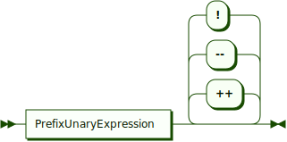

```
PostfixUnaryExpression ::= PrefixUnaryExpression ( '++' | '--' | '!' )*
```

**PrefixUnaryExpression:**

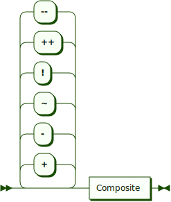

```
PrefixUnaryExpression ::= ( '+' | '-' | '~' | '!' | '++' | '--' )* Composite
```

**Composite:**


```
Composite ::= Atom ( '[' ( Expression | Expression? '..' Expression? ) ']' | '.' IDENTIFIER ArgumentList? | ArgumentList | ( 'switch' '{' MatchCases | 'with' '{' PropertyInitializers ) '}' )*
```

**ArgumentList:**

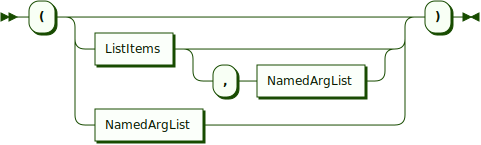

```
ArgumentList ::= '(' ( ExpressionList ( ',' NamedArgList )? | NamedArgList )? ')'
```

**NamedArgList:**


```
NamedArgList ::= NamedArg ( ',' NamedArg )*
```

**NamedArg:**


```
NamedArg ::= IDENTIFIER ':' Expression
```

**MatchCases:**


```
MatchCases ::= MatchCase ( ',' MatchCase )*
```

**MatchCase:**

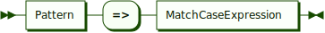

```
MatchCase ::= Pattern '=>' MatchCaseExpression
```

**Pattern:**


```
Pattern  ::= '_'
           | 'null'
           | TYPE_NAME ObjectPattern?
           | ObjectPattern
           | ValuePattern
           | RangePattern
           | PredicatePattern
           | CompositePattern
```

**ObjectPattern:**


```
ObjectPattern ::= '{' IDENTIFIER '=' ValuePattern ( ',' IDENTIFIER '=' ValuePattern )* '}'
```

**ValuePattern:**


```
ValuePattern ::= ( '+' | '-' )? ( BOOLEAN | INTEGER | BIG_INTEGER | FLOAT | BIG_DECIMAL | DATE | STRING )
```

**RangePattern:**


```
RangePattern
         ::= ValuePattern '..' ValuePattern?
           | '..' ValuePattern
```

**PredicatePattern:**


```
PredicatePattern ::= IDENTIFIER ':' Expression
```

**CompositePattern:**


```
CompositePattern ::= Pattern ( ',' Pattern )+
```

**MatchCaseExpression:**


```
MatchCaseExpression ::= Block | 'throw'? Expression
```

**Atom:**

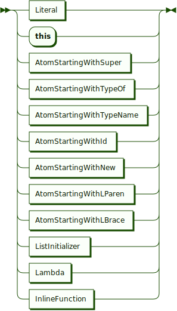

```
Atom     ::= Literal
           | 'this'
           | AtomStartingWithSuper
           | AtomStartingWithTypeOf
           | AtomStartingWithTypeName
           | AtomStartingWithId
           | AtomStartingWithNew
           | AtomStartingWithLParen
           | AtomStartingWithLBrace
           | ListInitializer
           | Lambda
           | InlineFunction
```

**Literal:**


```
Literal  ::= 'null'
           | BOOLEAN
           | INTEGER
           | BIG_INTEGER
           | FLOAT
           | BIG_DECIMAL
           | DATE
           | STRING
```

**AtomStartingWithSuper:**


```
AtomStartingWithSuper ::= 'super' ( '::' IDENTIFIER ArgumentList? | '[' Expression ']' )
```

**AtomStartingWithTypeOf:**


```
AtomStartingWithTypeOf ::= 'typeof' '(' ( TYPE_NAME | IDENTIFIER ) ')'
```

**AtomStartingWithTypeName:**


```
AtomStartingWithTypeName ::= TYPE_NAME '::' IDENTIFIER ArgumentList?
```

**AtomStartingWithId:**

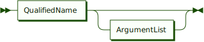

```
AtomStartingWithId ::= QualifiedName ArgumentList?
```

**AtomStartingWithNew:**


```
AtomStartingWithNew ::= ObjectInitializer | ConstructorCall
```

**ObjectInitializer:**


```
ObjectInitializer ::= 'new' '{' PropertyInitializers? '}'
```

**ConstructorCall:**

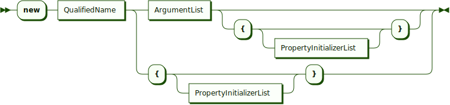

```
ConstructorCall ::= 'new' QualifiedName ArgumentList? ( '{' PropertyInitializers? '}' )?
```

**AtomStartingWithLParen:**


```
AtomStartingWithLParen
         ::= Conversion
           | ComplexInitializer
           | ParenthesizedExpression
```

**Conversion:**


```
Conversion ::= '(' TYPE_NAME ')' Expression
```

**ComplexInitializer:**


```
ComplexInitializer ::= '(' Expression ',' Expression ')'
```

**ParenthesizedExpression:**


```
ParenthesizedExpression ::= '(' Expression ')'
```

**AtomStartingWithLBrace:**

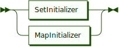

```
AtomStartingWithLBrace ::= SetInitializer | MapInitializer
```

**SetInitializer:**


```
SetInitializer ::= '{' ExpressionList? '}'
```

**MapInitializer:**


```
MapInitializer ::= '{' ( MapItemInitializers | '=>' ) '}'
```

**MapItemInitializers:**


```
MapItemInitializers ::= MapItemInitializer ( ',' MapItemInitializer )*
```

**MapItemInitializer:**


```
MapItemInitializer ::= Expression '=>' Expression
```

**ListInitializer:**

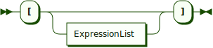

```
ListInitializer ::= '[' ExpressionList? ']'
```

**Lambda:**


```
Lambda ::= '|' ( Parameter ( ',' Parameter )* )? '|' '=>' FunctionBody
```

**InlineFunction:**


```
InlineFunction ::= 'function' ParameterList Block
```

## Terminal symbols

**LETTER:**


```
LETTER   ::= 'A' - 'Z' | 'a' - 'z'
```

**LETTER_EXTENDED:**


```
LETTER_EXTENDED
         ::= LETTER
           | '_'
           | '\xc0' - '\xd6'
           | '\xd8' - '\xf6'
           | '\xf8' - '\xff'
```

**DIGIT:**

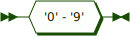

```
DIGIT ::= '0' - '9'
```

**HEXDIGIT:**


```
HEXDIGIT ::= DIGIT | 'A' - 'F' | 'a' - 'f'
```

**IDENTIFIER:**

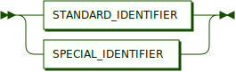

```
IDENTIFIER ::= STANDARD_IDENTIFIER | SPECIAL_IDENTIFIER
```

**STANDARD_IDENTIFIER:**


```
STANDARD_IDENTIFIER ::= LETTER_EXTENDED ( LETTER_EXTENDED | DIGIT )*
```

**SPECIAL_IDENTIFIER:**


```
SPECIAL_IDENTIFIER ::= '$' ( LETTER_EXTENDED | DIGIT | ESCAPE_SEQ )+
```

**ESCAPE_SEQ:**


```
ESCAPE_SEQ
         ::= '\a'
           | '\b'
           | '\f'
           | '\n'
           | '\r'
           | '\t'
           | '\v'
           | ( '\x' | '\u' HEXDIGIT HEXDIGIT ) HEXDIGIT HEXDIGIT
```

**BOOLEAN:**


```
BOOLEAN  ::= 'true' | 'false'
```

**INTEGER:**

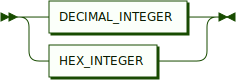

```
INTEGER  ::= DECIMAL_INTEGER | HEX_INTEGER
```

**DECIMAL_INTEGER:**


```
DECIMAL_INTEGER ::= ( DIGIT ( '_' DIGIT )* )+
```

**HEX_INTEGER:**

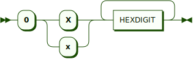

```
HEX_INTEGER ::= ( '0x' | '0X' ) HEXDIGIT+
```

**BIG_INTEGER:**


```
BIG_INTEGER ::= INTEGER ( 'l' | 'L' )
```

**FLOAT:**


```
FLOAT ::= DECIMAL_INTEGER ( '.' DECIMAL_INTEGER )? ( ( 'e' | 'E' ) ( '+' | '-' )? DECIMAL_INTEGER )? ( 'f' | 'F' )?
```

**BIG_DECIMAL:**


```
BIG_DECIMAL ::= DECIMAL_INTEGER ( '.' DECIMAL_INTEGER )? ( ( 'e' | 'E' ) ( '+' | '-' )? DECIMAL_INTEGER )? ( 'd' | 'D' )
```

**DATE:**


```
DATE ::= '`' [^`]* '`'
```

**STRING:**


```
STRING ::= ( '$' '@'? )? ( SINGLE_QUOTED | DOUBLE_QUOTED )
```

**SINGLE_QUOTED:**


```
SINGLE_QUOTED ::= "'" ( [^'] | ESCAPE_SEQ )* "'"
```

**DOUBLE_QUOTED:**


```
DOUBLE_QUOTED ::= '"' ( [^"] | ESCAPE_SEQ )* '"'
```

**TYPE_NAME:**


```
TYPE_NAME
         ::= 'void'
           | 'bool'
           | 'int'
           | 'long'
           | 'rational'
           | 'float'
           | 'decimal'
           | 'complex'
           | 'date'
           | 'string'
           | 'list'
           | 'map'
           | 'set'
           | 'queue'
           | 'stack'
           | 'object'
           | 'resource'
           | 'closure'
```

**MODIFIER:**


```
MODIFIER ::= 'final'
           | 'static'
           | 'abstract'
```

**SCOPE:**

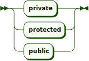

```
SCOPE    ::= 'private'
           | 'protected'
           | 'public'
```

[Home](README.md) | [Previous](exceptions.md) | [Next](extapi.md)