# AddyScript grammar

The following railroad diagrams summarize the syntax of the AddyScript language. They were generated with the help of a tool called [_Railroad Diagram Generator_](https://rr.red-dove.com/ui). Thanks to the authors!

### Axiom

**Program:**


```
Program  ::= StatementWithLabels*
```

### Non-terminal symbols

**StatementWithLabels:**

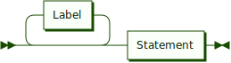

```
StatementWithLabels ::= Label* Statement
```

**Label:**

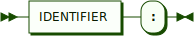

```
Label ::= IDENTIFIER ':'
```

**Statement:**


```
Statement ::= ImportDirective
            | ClassDefinition
            | FunctionDecl
            | ExternalFunctionDecl
            | ConstantDecl
            | VariableDecl
            | Block
            | IfElse
            | SwitchBlock
            | ForLoop
            | ForEachLoop
            | WhileLoop
            | DoLoop
            | Continue
            | Break
            | Goto
            | Yield
            | Return
            | Throw
            | TryCatchFinally
            | GroupAssignment
            | Expression ';'
```

**ImportDirective:**


```
ImportDirective ::= 'import' QualifiedName ( 'as' IDENTIFIER )? ';'
```

**QualifiedName:**


```
QualifiedName ::= IDENTIFIER ( '::' IDENTIFIER )*
```

**ClassDefinition:**


```
ClassDefinition ::= Attributes? MODIFIER? 'class' IDENTIFIER ( ':' IDENTIFIER )? '{' ClassMember* '}'
```

**Attributes:**

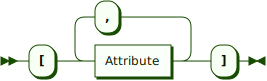

```
Attributes ::= '[' Attribute ( ',' Attribute )* ']'
```

**Attribute:**


```
Attribute ::= IDENTIFIER ( '(' ( Expression | ( Expression ',' )? PropertyInitializerList )? ')' )?
```

**ClassMember:**


```
ClassMember ::= MemberPrefix? MemberSpec
```

**MemberPrefix:**

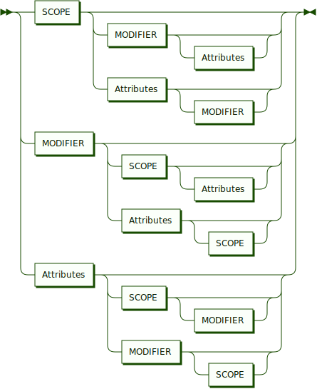

```
MemberPrefix ::= SCOPE ( MODIFIER Attributes? | Attributes MODIFIER? )?
               | MODIFIER ( SCOPE Attributes? | Attributes SCOPE? )?
               | Attributes ( SCOPE MODIFIER? | MODIFIER SCOPE? )?
```

**MemberSpec:**


```
MemberSpec ::= ConstructorSpec
             | FieldSpec
             | PropertySpec
             | MethodSpec
             | OperatorSpec
             | EventSpec
```

**ConstructorSpec:**


```
ConstructorSpec ::= 'constructor' ParameterList Block
```

**ParameterList:**

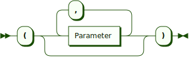

```
ParameterList ::= '(' ( Parameter ( ',' Parameter )* )? ')'
```

**Parameter:**

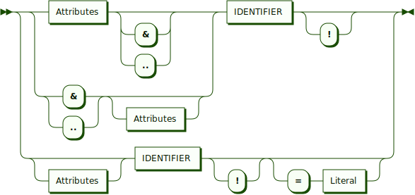

```
Parameter ::= ( Attributes ( '&' | '..' )? | ( '&' | '..' ) Attributes? ) IDENTIFIER '!'? | Attributes? IDENTIFIER '!'? ( '=' Literal )?
```

**Literal:**


```
Literal  ::= 'null'
           | BOOLEAN
           | INTEGER
           | BIG_INTEGER
           | FLOAT
           | BIG_DECIMAL
           | DATE
           | STRING
```

**FieldSpec:**


```
FieldSpec ::= IDENTIFIER ( '=' Expression )? ';'
```

**PropertySpec:**


```
PropertySpec ::= 'property' ( IDENTIFIER | '[]' ) ( ( '=>' Expression )? ';' | '{' SCOPE? ( 'read' ( MethodBody SCOPE? 'write' )? | 'write' ( MethodBody SCOPE? 'read' )? ) MethodBody '}' )
```
<sub>**Remarks**: if the first accessor defined has an empty body, it should be the same for the other accessor if it's defined. Both accessors cannot have custom a scope. An accessor scope shoulb always be more restrictive than the scope of the property itself</sub>

**MethodBody:**

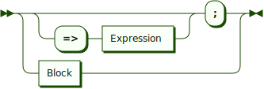

```
MethodBody ::= ( '=>' Expression )? ';' | Block
```

**MethodSpec:**


```
MethodSpec ::= 'function' IDENTIFIER ParameterList MethodBody
```

**OperatorSpec:**


```
OperatorSpec ::= 'operator' OverloadableOperator ParameterList MethodBody
```

**OverloadableOperator:**


```
OverloadableOperator ::= '+'
                       | '-'
                       | '++'
                       | '--'
                       | '~'
                       | '*'
                       | '/'
                       | '%'
                       | '**'
                       | '&'
                       | '|'
                       | '^'
                       | '<<'
                       | '>>'
                       | '=='
                       | '!='
                       | '<'
                       | '>'
                       | '<='
                       | '>='
                       | 'startswith'
                       | 'endswith'
                       | 'contains'
                       | 'matches'
```

**EventSpec:**


```
EventSpec ::= 'event' ParameterList ';'
```

**FunctionDecl:**


```
FunctionDecl ::= Attributes? 'function' IDENTIFIER ParameterList FunctionBody
```

**FunctionBody:**

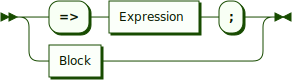

```
FunctionBody ::= '=>' Expression ';' | Block
```

**ExternalFunctionDecl:**


```
ExternalFunctionDecl ::= Attributes? 'extern' 'function' IDENTIFIER ParameterList ';'
```

**ConstantDecl:**


```
ConstantDecl ::= 'const' PropertyInitializerList ';'
```

**VariableDecl:**


```
VariableDecl ::= 'var' PropertyInitializerList ';'
```

**PropertyInitializerList:**


```
PropertyInitializerList ::= PropertyInitializer ( ',' PropertyInitializer )*
```

**PropertyInitializer:**

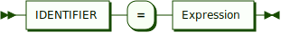

```
PropertyInitializer ::= IDENTIFIER '=' Expression
```

**Block:**

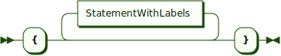

```
Block ::= '{' StatementWithLabels* '}'
```

**IfElse:**


```
IfElse ::= 'if' '(' Expression ')' Statement ( 'else' Statement )?
```

**SwitchBlock:**


```
SwitchBlock ::= 'switch' '(' Expression ')' '{' ( CaseLabel ':' StatementWithLabels* )* ( 'default' ':' StatementWithLabels* )? '}'
```

**CaseLabel:**


```
CaseLabel ::= 'case' ( BOOLEAN | INTEGER | STRING )
```

**ForLoop:**

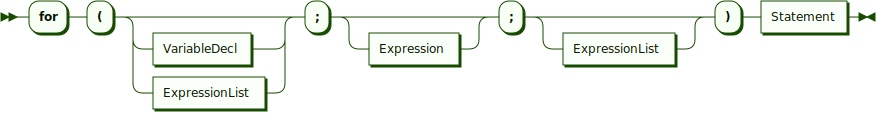

```
ForLoop ::= 'for' '(' ( VariableDecl | ExpressionList )? ';' Expression? ';' ExpressionList? ')' Statement
```

**ExpressionList:**


```
ExpressionList ::= Expression ( ',' Expression )*
```

**ForEachLoop:**


```
ForEachLoop ::= 'foreach' '(' IDENTIFIER ( '=>' IDENTIFIER )? 'in' Expression ')' Statement
```

**WhileLoop:**

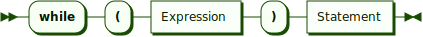

```
WhileLoop ::= 'while' '(' Expression ')' Statement
```

**DoLoop:**


```
DoLoop ::= 'do' Statement 'while' '(' Expression ')' ';'
```

**Continue:**


```
Continue ::= 'continue' ';'
```

**Break:**


```
Break ::= 'break' ';'
```

**Goto:**

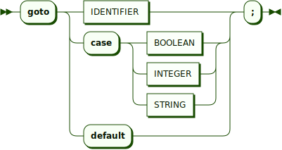

```
Goto ::= 'goto' ( IDENTIFIER | 'case' ( BOOLEAN | INTEGER | STRING ) | 'default' ) ';'
```

**Yield:**

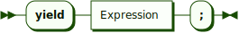

```
Yield ::= 'yield' Expression ';'
```

**Return:**


```
Return ::= 'return' Expression? ';'
```

**Throw:**


```
Throw ::= 'throw' Expression ';'
```

**TryCatchFinally:**


```
TryCatchFinally ::= 'try' ( '(' Expression ')' )? Block ( 'catch' '(' IDENTIFIER ')' Block )? ( 'finally' Block )?
```

**GroupAssignment:**

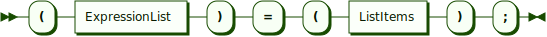

```
GroupAssignment ::= '(' ExpressionList ')' '=' '(' ListItems ')' ';'
```

**ListItems:**


```
ListItems
         ::= ListItem ( ',' ListItem )*
```

**ListItem:**


```
ListItem ::= '..'? Expression
```

**Expression:**


```
Expression ::= Assignment
```

**Assignment:**


```
Assignment ::= TernaryExpression ( AssignmentOperator Assignment )*
```

**AssignmentOperator:**


```
AssignmentOperator ::= '='
                     | '+='
                     | '-='
                     | '*='
                     | '/='
                     | '%='
                     | '**='
                     | '&='
                     | '|='
                     | '^='
                     | '<<='
                     | '>>='
                     | '??='
```

**TernaryExpression:**


```
TernaryExpression ::= Condition ( '?' Expression ':' Expression )?
```

**Condition:**


```
Condition ::= Relation ( LogicalOperator Relation )*
```

**LogicalOperator:**


```
LogicalOperator ::= '&'
                  | '&&'
                  | '|'
                  | '||'
                  | '^'
                  | '??'
```

**Relation:**


```
Relation ::= Term ( RelationalOperator Term | 'is' 'not'? ( TYPE_NAME | IDENTIFIER ) )?
```

**RelationalOperator:**

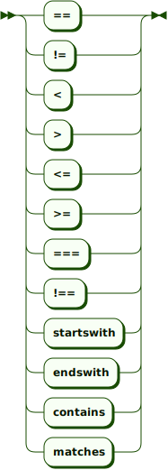

```
RelationalOperator ::= '=='
                     | '!='
                     | '<'
                     | '>'
                     | '<='
                     | '>='
                     | '==='
                     | '!=='
                     | 'startswith'
                     | 'endswith'
                     | 'contains'
                     | 'matches'
```

**Term:**


```
Term ::= Factor ( ( '+' | '-' ) Factor )*
```

**Factor:**


```
Factor ::= Exponentiation ( ( '*' | '/' | '%' | '<<' | '>>' ) Exponentiation )*
```

**Exponentiation:**


```
Exponentiation ::= PostfixUnaryExpression ( '**' Exponentiation )*
```

**PostfixUnaryExpression:**


```
PostfixUnaryExpression ::= PrefixUnaryExpression ( '++' | '--' | '!' )*
```

**PrefixUnaryExpression:**


```
PrefixUnaryExpression ::= ( '+' | '-' | '~' | '!' | '++' | '--' )* Composite
```

**Composite:**


```
Composite ::= Atom ( '[' ( Expression | Expression? '..' Expression? ) ']' | '.' IDENTIFIER ArgumentList? | ArgumentList | ( 'switch' '{' MatchCaseList | 'with' '{' PropertyInitializerList ) '}' )*
```

**ArgumentList:**


```
ArgumentList ::= '(' ( ListItems ( ',' NamedArgList )? | NamedArgList )? ')'
```

**NamedArgList:**


```
NamedArgList ::= NamedArg ( ',' NamedArg )*
```

**NamedArg:**


```
NamedArg ::= IDENTIFIER ':' Expression
```

**MatchCaseList:**


```
MatchCaseList ::= MatchCase ( ',' MatchCase )*
```

**MatchCase:**


```
MatchCase ::= Pattern '=>' MatchCaseExpression
```

**Pattern:**


```
Pattern ::= '_'
          | 'null'
          | ValuePattern ( '..' ValuePattern? )?
          | '..' ValuePattern
          | TYPE_NAME ObjectPattern?
          | ObjectPattern
          | IDENTIFIER ':' Expression
          | CompositePattern
```

**ValuePattern:**


```
ValuePattern ::= [+-]? ( INTEGER | BIG_INTEGER | FLOAT | BIG_DECIMAL )
               | BOOLEAN
               | DATE
               | STRING
```

**ObjectPattern:**


```
ObjectPattern ::= '{' IDENTIFIER '=' ValuePattern ( ',' IDENTIFIER '=' ValuePattern )* '}'
```

**CompositePattern:**


```
CompositePattern ::= Pattern ( ',' Pattern )+
```

**MatchCaseExpression:**


```
MatchCaseExpression ::= Block | 'throw'? Expression
```

**Atom:**


```
Atom ::= Literal
       | 'this'
       | AtomStartingWithSuper
       | AtomStartingWithTypeOf
       | AtomStartingWithTypeName
       | AtomStartingWithId
       | AtomStartingWithNew
       | AtomStartingWithLParen
       | AtomStartingWithLBrace
       | ListInitializer
       | Lambda
       | InlineFunction
```

**AtomStartingWithSuper:**

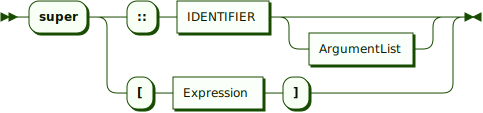

```
AtomStartingWithSuper ::= 'super' ( '::' IDENTIFIER ArgumentList? | '[' Expression ']' )
```

**AtomStartingWithTypeOf:**


```
AtomStartingWithTypeOf ::= 'typeof' '(' ( TYPE_NAME | IDENTIFIER ) ')'
```

**AtomStartingWithTypeName:**


```
AtomStartingWithTypeName ::= TYPE_NAME '::' IDENTIFIER ArgumentList?
```

**AtomStartingWithId:**


```
AtomStartingWithId ::= QualifiedName ArgumentList?
```

**AtomStartingWithNew:**

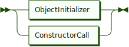

```
AtomStartingWithNew ::= ObjectInitializer | ConstructorCall
```

**ObjectInitializer:**

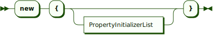

```
ObjectInitializer ::= 'new' '{' PropertyInitializerList? '}'
```

**ConstructorCall:**


```
ConstructorCall ::= 'new' QualifiedName ( ArgumentList ( '{' PropertyInitializerList? '}' )? | '{' PropertyInitializerList? '}' )
```

**AtomStartingWithLParen:**


```
AtomStartingWithLParen ::= Conversion | ComplexInitializer | ParenthesizedExpression
```

**Conversion:**


```
Conversion ::= '(' TYPE_NAME ')' Expression
```

**ComplexInitializer:**


```
ComplexInitializer ::= '(' Expression ',' Expression ')'
```

**ParenthesizedExpression:**

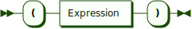

```
ParenthesizedExpression ::= '(' Expression ')'
```

**AtomStartingWithLBrace:**


```
AtomStartingWithLBrace ::= SetInitializer | MapInitializer
```

**SetInitializer:**

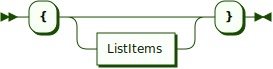

```
SetInitializer ::= '{' ListItems? '}'
```

**MapInitializer:**


```
MapInitializer ::= '{' ( MapItemInitializerList | '=>' ) '}'
```

**MapItemInitializerList:**


```
MapItemInitializerList ::= MapItemInitializer ( ',' MapItemInitializer )*
```

**MapItemInitializer:**


```
MapItemInitializer ::= Expression '=>' Expression
```

**ListInitializer:**


```
ListInitializer ::= '[' ListItems? ']'
```

**Lambda:**


```
Lambda ::= '|' ( Parameter ( ',' Parameter )* )? '|' '=>' ( Expression ';' | Block )
```

**InlineFunction:**


```
InlineFunction ::= 'function' ParameterList Block
```

### Terminal symbols

**LETTER:**

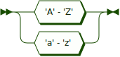

```
LETTER ::= 'A' - 'Z' | 'a' - 'z'
```

**LETTER_EXTENDED:**


```
LETTER_EXTENDED ::= LETTER
                  | '_'
                  | '\xc0' - '\xd6'
                  | '\xd8' - '\xf6'
                  | '\xf8' - '\xff'
```

**DIGIT:**


```
DIGIT ::= '0' - '9'
```

**HEXDIGIT:**


```
HEXDIGIT ::= DIGIT
           | 'A' - 'F'
           | 'a' - 'f'
```

**IDENTIFIER:**


```
IDENTIFIER ::= STANDARD_IDENTIFIER | SPECIAL_IDENTIFIER
```

**STANDARD_IDENTIFIER:**

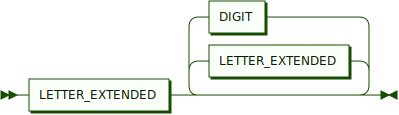

```
STANDARD_IDENTIFIER ::= LETTER_EXTENDED ( LETTER_EXTENDED | DIGIT )*
```

**SPECIAL_IDENTIFIER:**


```
SPECIAL_IDENTIFIER ::= '$' ( LETTER_EXTENDED | DIGIT | ESCAPE_SEQ )+
```

**ESCAPE_SEQ:**

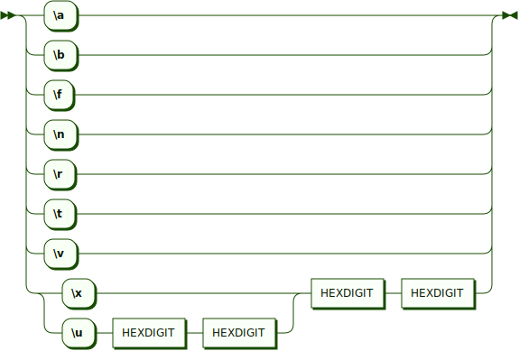

```
ESCAPE_SEQ ::= '\a'
             | '\b'
             | '\f'
             | '\n'
             | '\r'
             | '\t'
             | '\v'
             | ( '\x' | '\u' HEXDIGIT HEXDIGIT ) HEXDIGIT HEXDIGIT
```

**BOOLEAN:**

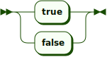

```
BOOLEAN ::= 'true' | 'false'
```

**INTEGER:**


```
INTEGER ::= DECIMAL_INTEGER | HEX_INTEGER
```

**DECIMAL_INTEGER:**


```
DECIMAL_INTEGER ::= ( DIGIT ( '_' DIGIT )* )+
```

**HEX_INTEGER:**


```
HEX_INTEGER ::= '0' [Xx] HEXDIGIT+
```

**BIG_INTEGER:**


```
BIG_INTEGER ::= INTEGER [Ll]
```

**REAL:**


```
REAL ::= ( DECIMAL_INTEGER? '.' )? DECIMAL_INTEGER ( ( 'e' | 'E' ) ( '+' | '-' )? DECIMAL_INTEGER )?
```

**FLOAT:**


```
FLOAT ::= REAL [Ff]?
```

**BIG_DECIMAL:**

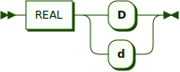

```
BIG_DECIMAL ::= REAL [Dd]
```

**DATE:**


```
DATE ::= '`' [^`]* '`'
```

**STRING:**


```
STRING ::= ( '$' '@'? )? ( SINGLE_QUOTED | DOUBLE_QUOTED )
```

**SINGLE_QUOTED:**

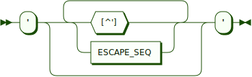

```
SINGLE_QUOTED ::= "'" ( [^'] | ESCAPE_SEQ )* "'"
```

**DOUBLE_QUOTED:**

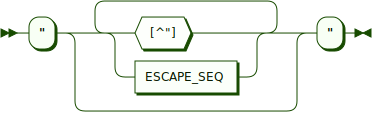

```
DOUBLE_QUOTED ::= '"' ( [^"] | ESCAPE_SEQ )* '"'
```

**TYPE_NAME:**

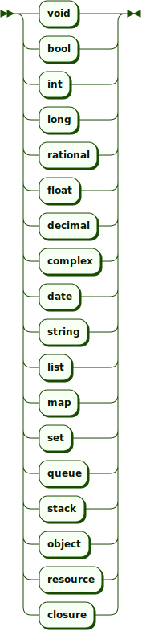

```
TYPE_NAME ::= 'void'
            | 'bool'
            | 'int'
            | 'long'
            | 'rational'
            | 'float'
            | 'decimal'
            | 'complex'
            | 'date'
            | 'string'
            | 'list'
            | 'map'
            | 'set'
            | 'queue'
            | 'stack'
            | 'object'
            | 'resource'
            | 'closure'
```

**MODIFIER:**


```
MODIFIER ::= 'final'
           | 'static'
           | 'abstract'
```

**SCOPE**


```
SCOPE ::= 'private'
        | 'protected'
        | 'public'
```

[Home](README.md) | [Previous](exceptions.md) | [Next](extapi.md)