**Program:**


```
Program  ::= StatementWithLabels*
```

**StatementWithLabels:**


```
StatementWithLabels
         ::= Label* Statement
```

referenced by:

* Block
* Program
* SwitchBlock

**Label:**


```
Label    ::= IDENTIFIER ':'
```

referenced by:

* StatementWithLabels

**Statement:**

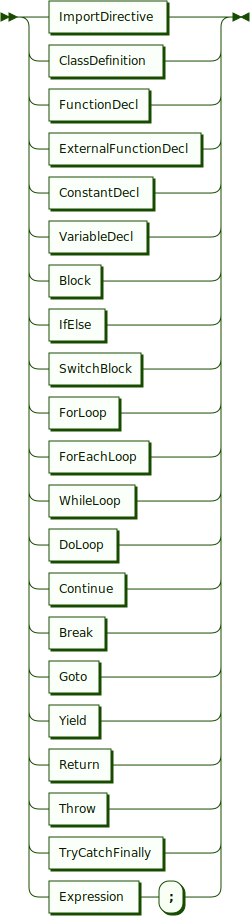

```
Statement
         ::= ImportDirective
           | ClassDefinition
           | FunctionDecl
           | ExternalFunctionDecl
           | ConstantDecl
           | VariableDecl
           | Block
           | IfElse
           | SwitchBlock
           | ForLoop
           | ForEachLoop
           | WhileLoop
           | DoLoop
           | Continue
           | Break
           | Goto
           | Yield
           | Return
           | Throw
           | TryCatchFinally
           | GroupAssignment
           | Expression ';'
```

referenced by:

* DoLoop
* ForEachLoop
* ForLoop
* IfElse
* StatementWithLabels
* WhileLoop

**ImportDirective:**


```
ImportDirective
         ::= 'import' QualifiedName ( 'as' IDENTIFIER )? ';'
```

referenced by:

* Statement

**QualifiedName:**

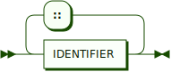

```
QualifiedName
         ::= IDENTIFIER ( '::' IDENTIFIER )*
```

referenced by:

* AtomStartingWithId
* ConstructorCall
* ImportDirective

**ClassDefinition:**

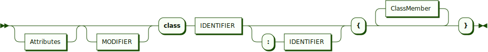

```
ClassDefinition
         ::= Attributes? MODIFIER? 'class' IDENTIFIER ( ':' IDENTIFIER )? '{' ClassMember* '}'
```

referenced by:

* Statement

**Attributes:**


```
Attributes
         ::= '[' Attribute ( ',' Attribute )* ']'
```

referenced by:

* ClassDefinition
* ExternalFunctionDecl
* FunctionDecl
* MemberPrefix
* Parameter

**Attribute:**


```
Attribute
         ::= IDENTIFIER ( '(' ( Expression | ( Expression ',' )? PropertyInitializerList )? ')' )?
```

referenced by:

* Attributes

**ClassMember:**


```
ClassMember
         ::= MemberPrefix? MemberSpec
```

referenced by:

* ClassDefinition

**MemberPrefix:**


```
MemberPrefix
         ::= SCOPE ( MODIFIER Attributes? | Attributes MODIFIER? )?
           | MODIFIER ( SCOPE Attributes? | Attributes SCOPE? )?
           | Attributes ( SCOPE MODIFIER? | MODIFIER SCOPE? )?
```

referenced by:

* ClassMember

**MemberSpec:**

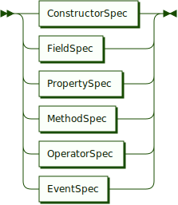

```
MemberSpec
         ::= ConstructorSpec
           | FieldSpec
           | PropertySpec
           | MethodSpec
           | OperatorSpec
           | EventSpec
```

referenced by:

* ClassMember

**ConstructorSpec:**


```
ConstructorSpec
         ::= 'constructor' ParameterList Block
```

referenced by:

* MemberSpec

**ParameterList:**


```
ParameterList
         ::= '(' ( Parameter ( ',' Parameter )* )? ')'
```

referenced by:

* ConstructorSpec
* EventSpec
* ExternalFunctionDecl
* FunctionDecl
* InlineFunction
* MethodSpec
* OperatorSpec

**Parameter:**


```
Parameter
         ::= ( Attributes ( '&' | '..' )? | ( '&' | '..' ) Attributes? ) IDENTIFIER '!'?
           | Attributes? IDENTIFIER '!'? ( '=' Literal )?
```

referenced by:

* Lambda
* ParameterList

**Literal:**

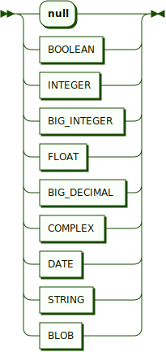

```
Literal  ::= 'null'
           | BOOLEAN
           | INTEGER
           | BIG_INTEGER
           | FLOAT
           | BIG_DECIMAL
           | DATE
           | STRING
```

referenced by:

* Atom
* Parameter

**FieldSpec:**

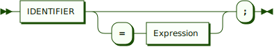

```
FieldSpec
         ::= IDENTIFIER ( '=' Expression )? ';'
```

referenced by:

* MemberSpec

**PropertySpec:**

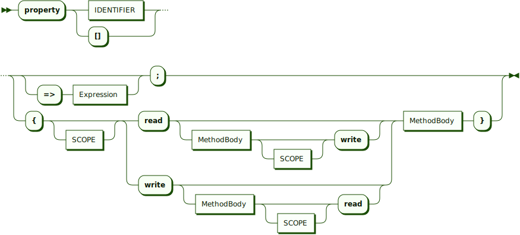

```
PropertySpec
         ::= 'property' ( IDENTIFIER | '[]' ) ( ( '=>' Expression )? ';' | '{' SCOPE? ( 'read' ( MethodBody SCOPE? 'write' )? | 'write' ( MethodBody SCOPE? 'read' )? ) MethodBody '}' )
```

referenced by:

* MemberSpec

**MethodBody:**


```
MethodBody
         ::= ( '=>' Expression )? ';'
           | Block
```

referenced by:

* MethodSpec
* OperatorSpec
* PropertySpec

**MethodSpec:**

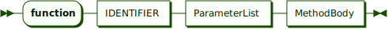

```
MethodSpec
         ::= 'function' IDENTIFIER ParameterList MethodBody
```

referenced by:

* MemberSpec

**OperatorSpec:**

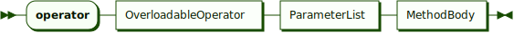

```
OperatorSpec
         ::= 'operator' OverloadableOperator ParameterList MethodBody
```

referenced by:

* MemberSpec

**OverloadableOperator:**

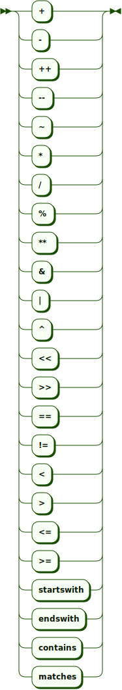

```
OverloadableOperator
         ::= '+'
           | '-'
           | '++'
           | '--'
           | '~'
           | '*'
           | '/'
           | '%'
           | '**'
           | '&'
           | '|'
           | '^'
           | '<<'
           | '>>'
           | '=='
           | '!='
           | '<'
           | '>'
           | '<='
           | '>='
           | 'startswith'
           | 'endswith'
           | 'contains'
           | 'matches'
```

referenced by:

* OperatorSpec

**EventSpec:**

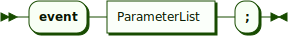

```
EventSpec
         ::= 'event' ParameterList ';'
```

referenced by:

* MemberSpec

**FunctionDecl:**

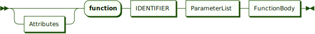

```
FunctionDecl
         ::= Attributes? 'function' IDENTIFIER ParameterList FunctionBody
```

referenced by:

* Statement

**FunctionBody:**


```
FunctionBody
         ::= '=>' Expression ';'
           | Block
```

referenced by:

* FunctionDecl

**ExternalFunctionDecl:**


```
ExternalFunctionDecl
         ::= Attributes? 'extern' 'function' IDENTIFIER ParameterList ';'
```

referenced by:

* Statement

**PropertyInitializerList:**


```
PropertyInitializerList
         ::= PropertyInitializer ( ',' PropertyInitializer )*
```

referenced by:

* Attribute
* Composite
* ConstantDecl
* ConstructorCall
* ObjectInitializer
* VariableDecl

**PropertyInitializer:**


```
PropertyInitializer
         ::= IDENTIFIER '=' Expression
```

referenced by:

* PropertyInitializerList

**ConstantDecl:**

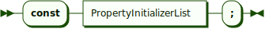

```
ConstantDecl
         ::= 'const' PropertyInitializerList ';'
```

referenced by:

* Statement

**VariableDecl:**


```
VariableDecl
         ::= 'var' PropertyInitializerList ';'
```

referenced by:

* ForLoop
* Statement

**Block:**


```
Block    ::= '{' StatementWithLabels* '}'
```

referenced by:

* ConstructorSpec
* FunctionBody
* InlineFunction
* Lambda
* MatchCaseExpression
* MethodBody
* Statement
* TryCatchFinally

**IfElse:**


```
IfElse   ::= 'if' '(' Expression ')' Statement ( 'else' Statement )?
```

referenced by:

* Statement

**SwitchBlock:**

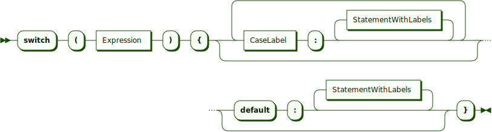

```
SwitchBlock
         ::= 'switch' '(' Expression ')' '{' ( CaseLabel ':' StatementWithLabels* )* ( 'default' ':' StatementWithLabels* )? '}'
```

referenced by:

* Statement

**CaseLabel:**


```
CaseLabel
         ::= 'case' ( BOOLEAN | INTEGER | STRING )
```

referenced by:

* SwitchBlock

**ForLoop:**


```
ForLoop  ::= 'for' '(' ( VariableDecl | ExpressionList )? ';' Expression? ';' ExpressionList? ')' Statement
```

referenced by:

* Statement

**ExpressionList:**


```
ExpressionList
         ::= Expression ( ',' Expression )*
```

referenced by:

* ForLoop
* GroupAssignment

**ForEachLoop:**


```
ForEachLoop
         ::= 'foreach' '(' IDENTIFIER ( '=>' IDENTIFIER )? 'in' Expression ')' Statement
```

referenced by:

* Statement

**WhileLoop:**


```
WhileLoop
         ::= 'while' '(' Expression ')' Statement
```

referenced by:

* Statement

**DoLoop:**

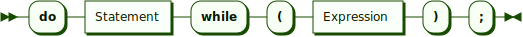

```
DoLoop   ::= 'do' Statement 'while' '(' Expression ')' ';'
```

referenced by:

* Statement

**Continue:**


```
Continue ::= 'continue' ';'
```

referenced by:

* Statement

**Break:**

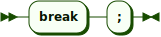

```
Break    ::= 'break' ';'
```

referenced by:

* Statement

**Goto:**


```
Goto     ::= 'goto' ( IDENTIFIER | 'case' ( BOOLEAN | INTEGER | STRING ) | 'default' ) ';'
```

referenced by:

* Statement

**Yield:**


```
Yield    ::= 'yield' Expression ';'
```

referenced by:

* Statement

**Return:**


```
Return   ::= 'return' Expression? ';'
```

referenced by:

* Statement

**Throw:**

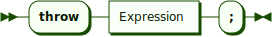

```
Throw    ::= 'throw' Expression ';'
```

referenced by:

* Statement

**TryCatchFinally:**

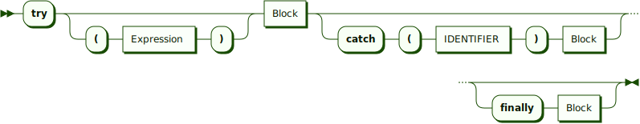

```
TryCatchFinally
         ::= 'try' ( '(' Expression ')' )? Block ( 'catch' '(' IDENTIFIER ')' Block )? ( 'finally' Block )?
```

referenced by:

* Statement

**GroupAssignment:**


```
GroupAssignment
         ::= '(' ExpressionList ')' '=' '(' ListItems ')' ';'
```

referenced by:

* Statement

**ListItems:**

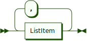

```
ListItems
         ::= ListItem ( ',' ListItem )*
```

referenced by:

* ArgumentList
* GroupAssignment
* ListInitializer
* SetInitializer

**ListItem:**


```
ListItem ::= '..'? Expression
```

referenced by:

* ListItems

**Expression:**


```
Expression
         ::= Assignment
```

referenced by:

* AtomStartingWithSuper
* Attribute
* ComplexInitializer
* Composite
* Conversion
* DoLoop
* ExpressionList
* FieldSpec
* ForEachLoop
* ForLoop
* FunctionBody
* IfElse
* Lambda
* ListItem
* MapItemInitializer
* MatchCaseExpression
* MethodBody
* NamedArg
* ParenthesizedExpression
* Pattern
* PropertyInitializer
* PropertySpec
* Return
* Statement
* SwitchBlock
* TernaryExpression
* Throw
* TryCatchFinally
* WhileLoop
* Yield

**Assignment:**

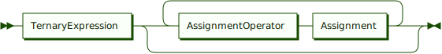

```
Assignment
         ::= TernaryExpression ( AssignmentOperator Assignment )*
```

referenced by:

* Assignment
* Expression

**AssignmentOperator:**


```
AssignmentOperator
         ::= '='
           | '+='
           | '-='
           | '*='
           | '/='
           | '%='
           | '**='
           | '&='
           | '|='
           | '^='
           | '<<='
           | '>>='
           | '??='
```

referenced by:

* Assignment

**TernaryExpression:**


```
TernaryExpression
         ::= Condition ( '?' Expression ':' Expression )?
```

referenced by:

* Assignment

**Condition:**

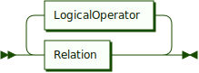

```
Condition
         ::= Relation ( LogicalOperator Relation )*
```

referenced by:

* TernaryExpression

**LogicalOperator:**


```
LogicalOperator
         ::= '&'
           | '&&'
           | '|'
           | '||'
           | '^'
           | '??'
```

referenced by:

* Condition

**Relation:**


```
Relation ::= Term ( RelationalOperator Term | 'is' ( TYPE_NAME | IDENTIFIER ) )?
```

referenced by:

* Condition

**RelationalOperator:**


```
RelationalOperator
         ::= '=='
           | '!='
           | '<'
           | '>'
           | '<='
           | '>='
           | '==='
           | '!=='
           | 'startswith'
           | 'endswith'
           | 'contains'
           | 'matches'
```

referenced by:

* Relation

**Term:**


```
Term     ::= Factor ( ( '+' | '-' ) Factor )*
```

referenced by:

* Relation

**Factor:**


```
Factor   ::= Exponentiation ( ( '*' | '/' | '%' | '<<' | '>>' ) Exponentiation )*
```

referenced by:

* Term

**Exponentiation:**


```
Exponentiation
         ::= PostfixUnaryExpression ( '**' Exponentiation )*
```

referenced by:

* Exponentiation
* Factor

**PostfixUnaryExpression:**


```
PostfixUnaryExpression
         ::= PrefixUnaryExpression ( '++' | '--' | '!' )*
```

referenced by:

* Exponentiation

**PrefixUnaryExpression:**


```
PrefixUnaryExpression
         ::= ( '+' | '-' | '~' | '!' | '++' | '--' )* Composite
```

referenced by:

* PostfixUnaryExpression

**Composite:**

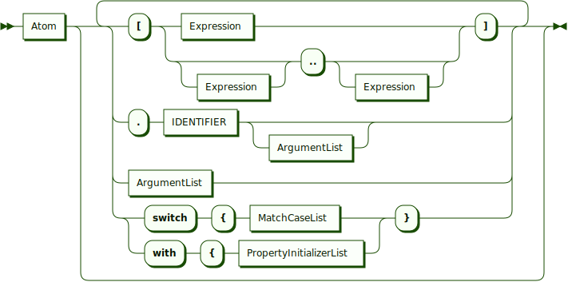

```
Composite
         ::= Atom ( '[' ( Expression | Expression? '..' Expression? ) ']' | '.' IDENTIFIER ArgumentList? | ArgumentList | ( 'switch' '{' MatchCaseList | 'with' '{' PropertyInitializerList ) '}' )*
```

referenced by:

* PrefixUnaryExpression

**ArgumentList:**


```
ArgumentList
         ::= '(' ( ListItems ( ',' NamedArgList )? | NamedArgList )? ')'
```

referenced by:

* AtomStartingWithId
* AtomStartingWithSuper
* AtomStartingWithTypeName
* Composite
* ConstructorCall

**NamedArgList:**

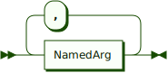

```
NamedArgList
         ::= NamedArg ( ',' NamedArg )*
```

referenced by:

* ArgumentList

**NamedArg:**


```
NamedArg ::= IDENTIFIER ':' Expression
```

referenced by:

* NamedArgList

**MatchCaseList:**

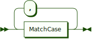

```
MatchCaseList
         ::= MatchCase ( ',' MatchCase )*
```

referenced by:

* Composite

**MatchCase:**


```
MatchCase
         ::= Pattern '=>' MatchCaseExpression
```

referenced by:

* MatchCaseList

**Pattern:**


```
Pattern  ::= '_'
           | 'null'
           | ValuePattern ( '..' ValuePattern? )?
           | '..' ValuePattern
           | TYPE_NAME ObjectPattern?
           | ObjectPattern
           | IDENTIFIER ':' Expression
           | CompositePattern
```

referenced by:

* CompositePattern
* MatchCase

**ValuePattern:**


```
ValuePattern
         ::= [+#x2D]? ( INTEGER | BIG_INTEGER | FLOAT | BIG_DECIMAL )
           | BOOLEAN
           | DATE
           | STRING
```

referenced by:

* ObjectPattern
* Pattern

**ObjectPattern:**


```
ObjectPattern
         ::= '{' IDENTIFIER '=' ValuePattern ( ',' IDENTIFIER '=' ValuePattern )* '}'
```

referenced by:

* Pattern

**CompositePattern:**

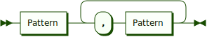

```
CompositePattern
         ::= Pattern ( ',' Pattern )+
```

referenced by:

* Pattern

**MatchCaseExpression:**

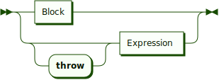

```
MatchCaseExpression
         ::= Block
           | 'throw'? Expression
```

referenced by:

* MatchCase

**Atom:**


```
Atom     ::= Literal
           | 'this'
           | AtomStartingWithSuper
           | AtomStartingWithTypeOf
           | AtomStartingWithTypeName
           | AtomStartingWithId
           | AtomStartingWithNew
           | AtomStartingWithLParen
           | AtomStartingWithLBrace
           | ListInitializer
           | Lambda
           | InlineFunction
```

referenced by:

* Composite

**AtomStartingWithSuper:**


```
AtomStartingWithSuper
         ::= 'super' ( '::' IDENTIFIER ArgumentList? | '[' Expression ']' )
```

referenced by:

* Atom

**AtomStartingWithTypeOf:**

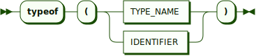

```
AtomStartingWithTypeOf
         ::= 'typeof' '(' ( TYPE_NAME | IDENTIFIER ) ')'
```

referenced by:

* Atom

**AtomStartingWithTypeName:**


```
AtomStartingWithTypeName
         ::= TYPE_NAME '::' IDENTIFIER ArgumentList?
```

referenced by:

* Atom

**AtomStartingWithId:**


```
AtomStartingWithId
         ::= QualifiedName ArgumentList?
```

referenced by:

* Atom

**AtomStartingWithNew:**


```
AtomStartingWithNew
         ::= ObjectInitializer
           | ConstructorCall
```

referenced by:

* Atom

**ObjectInitializer:**


```
ObjectInitializer
         ::= 'new' '{' PropertyInitializerList? '}'
```

referenced by:

* AtomStartingWithNew

**ConstructorCall:**


```
ConstructorCall
         ::= 'new' QualifiedName ( ArgumentList ( '{' PropertyInitializerList? '}' )? | '{' PropertyInitializerList? '}' )
```

referenced by:

* AtomStartingWithNew

**AtomStartingWithLParen:**

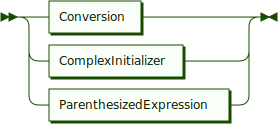

```
AtomStartingWithLParen
         ::= Conversion
           | ComplexInitializer
           | ParenthesizedExpression
```

referenced by:

* Atom

**Conversion:**

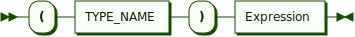

```
Conversion
         ::= '(' TYPE_NAME ')' Expression
```

referenced by:

* AtomStartingWithLParen

**ComplexInitializer:**

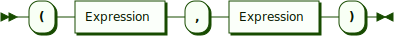

```
ComplexInitializer
         ::= '(' Expression ',' Expression ')'
```

referenced by:

* AtomStartingWithLParen

**ParenthesizedExpression:**


```
ParenthesizedExpression
         ::= '(' Expression ')'
```

referenced by:

* AtomStartingWithLParen

**AtomStartingWithLBrace:**


```
AtomStartingWithLBrace
         ::= SetInitializer
           | MapInitializer
```

referenced by:

* Atom

**SetInitializer:**


```
SetInitializer
         ::= '{' ListItems? '}'
```

referenced by:

* AtomStartingWithLBrace

**MapInitializer:**

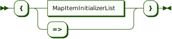

```
MapInitializer
         ::= '{' ( MapItemInitializerList | '=>' ) '}'
```

referenced by:

* AtomStartingWithLBrace

**MapItemInitializerList:**

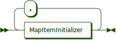

```
MapItemInitializerList
         ::= MapItemInitializer ( ',' MapItemInitializer )*
```

referenced by:

* MapInitializer

**MapItemInitializer:**

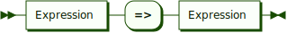

```
MapItemInitializer
         ::= Expression '=>' Expression
```

referenced by:

* MapItemInitializerList

**ListInitializer:**


```
ListInitializer
         ::= '[' ListItems? ']'
```

referenced by:

* Atom

**Lambda:**

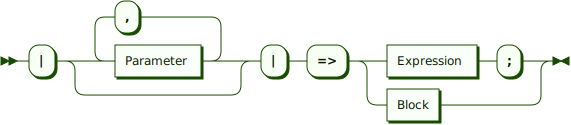

```
Lambda   ::= '|' ( Parameter ( ',' Parameter )* )? '|' '=>' ( Expression ';' | Block )
```

referenced by:

* Atom

**InlineFunction:**


```
InlineFunction
         ::= 'function' ParameterList Block
```

referenced by:

* Atom

**LETTER:**


```
LETTER   ::= 'A' - 'Z'
           | 'a' - 'z'
```

referenced by:

* LETTER_EXTENDED

**LETTER_EXTENDED:**

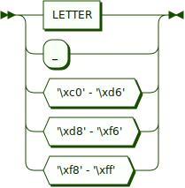

```
LETTER_EXTENDED
         ::= LETTER
           | '_'
           | '\xc0' - '\xd6'
           | '\xd8' - '\xf6'
           | '\xf8' - '\xff'
```

referenced by:

* SPECIAL_IDENTIFIER
* STANDARD_IDENTIFIER

**DIGIT:**


```
DIGIT    ::= '0' - '9'
```

referenced by:

* DECIMAL_INTEGER
* HEXDIGIT
* SPECIAL_IDENTIFIER
* STANDARD_IDENTIFIER

**HEXDIGIT:**

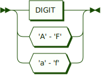

```
HEXDIGIT ::= DIGIT
           | 'A' - 'F'
           | 'a' - 'f'
```

referenced by:

* ESCAPE_SEQ
* HEX_INTEGER

**IDENTIFIER:**


```
IDENTIFIER
         ::= STANDARD_IDENTIFIER
           | SPECIAL_IDENTIFIER
```

referenced by:

* AtomStartingWithSuper
* AtomStartingWithTypeName
* AtomStartingWithTypeOf
* Attribute
* ClassDefinition
* Composite
* ExternalFunctionDecl
* FieldSpec
* ForEachLoop
* FunctionDecl
* Goto
* ImportDirective
* Label
* MethodSpec
* NamedArg
* ObjectPattern
* Parameter
* Pattern
* PropertyInitializer
* PropertySpec
* QualifiedName
* Relation
* TryCatchFinally

**STANDARD_IDENTIFIER:**


```
STANDARD_IDENTIFIER
         ::= LETTER_EXTENDED ( LETTER_EXTENDED | DIGIT )*
```

referenced by:

* IDENTIFIER

**SPECIAL_IDENTIFIER:**

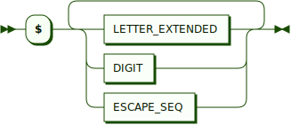

```
SPECIAL_IDENTIFIER
         ::= '$' ( LETTER_EXTENDED | DIGIT | ESCAPE_SEQ )+
```

referenced by:

* IDENTIFIER

**ESCAPE_SEQ:**


```
ESCAPE_SEQ
         ::= '\a'
           | '\b'
           | '\f'
           | '\n'
           | '\r'
           | '\t'
           | '\v'
           | ( '\x' | '\u' HEXDIGIT HEXDIGIT ) HEXDIGIT HEXDIGIT
```

referenced by:

* DOUBLE_QUOTED
* SINGLE_QUOTED
* SPECIAL_IDENTIFIER

**BOOLEAN:**


```
BOOLEAN  ::= 'true'
           | 'false'
```

referenced by:

* CaseLabel
* Goto
* Literal
* ValuePattern

**INTEGER:**


```
INTEGER  ::= DECIMAL_INTEGER
           | HEX_INTEGER
```

referenced by:

* BIG_INTEGER
* CaseLabel
* Goto
* Literal
* ValuePattern

**DECIMAL_INTEGER:**

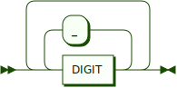

```
DECIMAL_INTEGER
         ::= ( DIGIT ( '_' DIGIT )* )+
```

referenced by:

* INTEGER
* REAL

**HEX_INTEGER:**


```
HEX_INTEGER
         ::= '0' [Xx] HEXDIGIT+
```

referenced by:

* INTEGER

**BIG_INTEGER:**

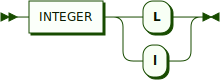

```
BIG_INTEGER
         ::= INTEGER [Ll]
```

referenced by:

* Literal
* ValuePattern

**REAL:**

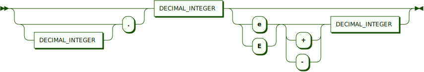

```
REAL     ::= ( DECIMAL_INTEGER? '.' )? DECIMAL_INTEGER ( ( 'e' | 'E' ) ( '+' | '-' )? DECIMAL_INTEGER )?
```

referenced by:

* BIG_DECIMAL
* FLOAT

**FLOAT:**

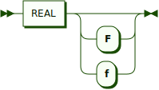

```
FLOAT    ::= REAL [Ff]?
```

referenced by:

* Literal
* ValuePattern

**BIG_DECIMAL:**


```
BIG_DECIMAL
         ::= REAL [Dd]
```

referenced by:

* Literal
* ValuePattern

**DATE:**


```
DATE     ::= '`' [^`]* '`'
```

referenced by:

* Literal
* ValuePattern

**STRING:**


```
STRING   ::= ( '$' '@'? )? ( SINGLE_QUOTED | DOUBLE_QUOTED )
```

referenced by:

* CaseLabel
* Goto
* Literal
* ValuePattern

**SINGLE_QUOTED:**


```
SINGLE_QUOTED
         ::= "'" ( [^'] | ESCAPE_SEQ )* "'"
```

referenced by:

* STRING

**DOUBLE_QUOTED:**


```
DOUBLE_QUOTED
         ::= '"' ( [^"] | ESCAPE_SEQ )* '"'
```

referenced by:

* STRING

**TYPE_NAME:**


```
TYPE_NAME
         ::= 'void'
           | 'bool'
           | 'int'
           | 'long'
           | 'rational'
           | 'float'
           | 'decimal'
           | 'complex'
           | 'date'
           | 'string'
           | 'list'
           | 'map'
           | 'set'
           | 'queue'
           | 'stack'
           | 'object'
           | 'resource'
           | 'closure'
```

referenced by:

* AtomStartingWithTypeName
* AtomStartingWithTypeOf
* Conversion
* Pattern
* Relation

**MODIFIER:**


```
MODIFIER ::= 'final'
           | 'static'
           | 'abstract'
```

referenced by:

* ClassDefinition
* MemberPrefix

## 
 <sup>generated by [RR - Railroad Diagram Generator][RR]</sup>

[RR]: https://www.bottlecaps.de/rr/ui