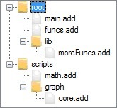

# User-defined functions

In addition to the predefined functions, users have the ability to define their own functions in AddyScript and use them.
The following sections describe how to do this.

## Creating a function

To create a function in AddyScript, simply use the following syntax:

``` { .text .no-copy }
function functionName (comma_separated_list_of_parameters)
{
    // function's logic goes here
    // returning a value is optional and can be done like this:
    return 10;
}
```

Example:

```addyscript linenums="1"
function sayHello()
{
    println("Hello to anyone!");
}

function sayHelloTo(name)
{
    println("Hello " + name);
    return readln("How do you do? ");
}

// Now we can call those 2 functions like this:

sayHello();

name = readln("What's your name? ");
ans = sayHelloTo(name);

if (ans != "fine")
    println("What's the matter?");
```

When the body of a function is reduced to a **return** statement or a simple expression,
the entire function can be formulated with this shorter syntax:

``` { .text .no-copy }
function functionName (comma_separated_list_of_parameters) => expression;
```

Example:

```addyscript linenums="1"
function addTwo(a, b) => a + b;

n = (float)readln('first number: ');
m = (float)readln('second number: ');
res = addTwo(n, m);
println($'the result is: {res}');
```

## Invoking functions

As in most languages, a function invocation in AddyScript consists of its name followed by a comma-separated list of arguments in parentheses.
In AddyScript, however, arguments can be either positional or named.

A positional argument is any expression that appears at a particular position in an argument list.
It is automatically mapped at runtime to the parameter that appears at the same position in the function header.

A named argument is one that consists of a name (i.e., an identifier) followed by a colon (:) and then an expression.
It is mapped to the parameter that has the same name in the function header.
Named arguments are particularly useful when you are calling a function that has optional parameters
and you do not want to provide values for some of the ones that come first in the function header.

Positional arguments must always come first in an argument list.
Once a named argument is encountered by the parser, it expects all subsequent arguments to be named as well.

Example:

```addyscript linenums="1"
// A function that concatenates values and wrap between a prefix and a suffix
function concat(values, separator = ', ', prefix = '{', suffix = '}')
	=> prefix + separator.join(..values) + suffix;

// A list to concatenate:
l = [8, 3, 4, 9, 2, 4, 6, 0, 7];

// Calling concat with default values for separator, prefix and suffix:
s1 = concat(l);
println('s1 = ' + s1);

// Calling concat with explicit values for separator, prefix and suffix:
// All arguments are positional
s2 = concat(l, '-', '[', ']');
println('s2 = ' + s2);

// Calling concat with an explicit value for separator and default values for prefix and suffix:
// All arguments are positional
s3 = concat(l, '; ');
println('s3 = ' + s3);

// Calling concat with explicit values for prefix and suffix:
// The prefix and suffix arguments are named
s4 = concat(l, prefix: '(', suffix: ')');
println('s4 = ' + s4);

// Calling concat with explicit values for separator, prefix and suffix:
// All arguments are named and given in random order
s5 = concat(suffix: '[', separator: ':', values: l, prefix: ']');
println('s5 = ' + s5);
```

### Spreading arguments

An important feature of the AddyScript syntax is that you can invoke a function with arguments of type **list**
or **set** preceded by the **spread operator** (..).
This tells AddyScript that the **list** or **set** should be substituted for its contents.
This works similarly to the right operand of group assignment.
The only requirement here is that none of the parameters provided by the spread collection should be passed to the function by reference.

Example:

```addyscript linenums="1"
function add(a, b, c) => a + b + c;

res = add(1, 2, 3);
println('add(1, 2, 3)' + res);
// Output: 6

l = [5, 6, 7];
res = add(..l);
println('add(..l)' + res);
// Output: 18

s = {9, 10};
res = add(..s, 11);
println('add(..s, 11)' + res);
// Output: 30

res = add(..l[2..], ..s);
println('add(..l[2..], ..s)' + res);
// Output: 26
```

## Manage how parameters are passed to a function

A parameter can be passed to a function by value, by reference, or as a variable-length list of values.
By default, parameters are passed by value.
To indicate that a parameter is passed by reference, simply prefix it with the ampersand sign (&).
Similarly, prefixing a parameter with the double-dot sign (..) keyword indicates that it represents a variable-length list of values.
Note that a variable-length list of values must always be the last in a parameter list.
Thus, a function cannot have multiple variable-length lists of values in its header.

When a parameter is passed by value to a function, it can be assigned a default value.
This makes the parameter optional (i.e., it does not need to be provided with a value when calling the function).
Once you add an optional parameter to a parameter list,
the only types of parameters that can follow are other optional parameters and a variable-length list of values.

Another feature that AddyScript offers in handling function parameters is emptiness checking.
When a parameter name is followed by an exclamation mark (!) in a function header,
this tells AddyScript that the parameter in question should not receive empty values.
Empty here means a null reference, a zero-length string, or an empty collection.
Whenever the parameter receives such a value, an exception is thrown.

## Closures

A closure is a function used as a variable.
Closures are typically used to pass functions as parameters to other functions (customizing their behavior)
or to return a function as the result of another function.
They appear in two forms in AddyScript: function references and inline function declarations.
A function reference is like a reference to a variable (a simple identifier in the code)
while an inline function declaration is an anonymous function definition that appears where an expression was expected.
Both techniques are illustrated in the example below:

Example:

```addyscript linenums="1"
// Repeats an action on each item of a list; parameter 'action' is a (mandatory) closure
function repeat(l, action!)
{
    foreach (item in l)
        action(item);
}

// A list for testing purpose
myList = [2, 5, 7, 8, 3, 0, 1, 6, 9, 4];

// Invoke repeat with a reference to the builtin 'println' function
repeat(myList, println);

// Declare a function inline and store it in a variable called myFunc
myFunc = function (n) {
    println('{0} x 2 = {1}', n, 2 * n);
};

// Invoke repeat with myFunc
repeat(myList, myFunc);

// Something more compact
repeat(myList, function (x) {
    println(x % 2 == 0 ? 'even' : 'odd');
});
```

### Remarks:

1. When the body of an anonymous function is reduced to a return statement or a simple expression, the entire function can be formulated like this: `|parameters| => expression`. In this form, we call it a **lambda expression**. For example, we could invoke the "repeat" function from the previous example like this: `repeat(myList, |n| => println('{0} x 2 = {1}', n, 2*n));`. A lambda expression can also have a real function body delimited by curly braces and optionally ending with a **return** statement.
2. If the parameter list of a lambda expression is empty, put a space between the vertical bars. This prevents parsers from confusing them with an or-else operator (\|\|).

### The closure's "bind" method

The **closure** type has a single member: the "bind" method. Its prototype is: `closure closure::bind(string parameterName, any defaultValue)`. Its main purpose is to create a clone of a closure with a modified prototype. The "bind" method operates as follows:

1. If _parameterName_ matches the name of an existing parameter in the original function's header, "bind" proceeds to **currying**: The parameter _parameterName_ is removed from the resulting function's header and is replaced by a fixed value, which in this case is _defaultValue_. The resulting function will then have one parameter less than the original one, with the exact same body that will always evaluate _parameterName_ to _defaultValue_. Here is an example of how to curry a function:

    ```addyscript linenums="1"
    // add is the original function: it simply adds two numbers
    function add(a, b) => a + b;

    // add10 is a variant of add that always use 10 for parameter a
    add10 = add.bind('a', 10);

    println(add10(5));
    println(add10(-7));
    ```
   
   ``` title="Output" { .text .no-copy }
   15
   3
   ```

2. If _parameterName_ doesn't match the name of an existing parameter in the original function's header, "bind" simply adds an optional parameter with the given name and default value to the resulting function. This is very helpful when you are creating a function that expects a closure as an argument and that you want the closure to match variable prototypes. As an example, the "each" method of the **list** type is defined as follows:

    ```addyscript linenums="1"
    public function each(action)
    {
        // action is replaced by a clone that has an optional parameter named __index
        action = action.bind('__index', null);

        foreach (__index => __value in this)
            action(__value, __index);
        
        return this;
    }
    ```

## External functions
AddyScript allows a script to invoke a function declared in a native library (such as a DLL or a shared object). To do this, the target function must first be declared as an external function in the script using this syntax:

``` { .text .no-copy }
[LibImport("nativeLibraryName", procName = "importedFunctionName", returnType = "someDotNetType")]
extern function functionName(list_of_parameters_with_type_attribute);
```

Where :

* _nativeLibraryName_ is the name of the native library that contains the definition of the function we want to import,
* _importedFunctionName_ is the name of the function we want to import, and
* _someDotNetType_ is the name of the return type of the function.
* _functionName_ is the name we want to give to the function in our code.

**Notes:**

1. If _functionName_ is equal to _importedFunctionName_, then the **procName** field of the **LibImport** attribute can be omitted.
2. If the function does not return anything, then **returnType** can also be omitted. 
3. Each parameter in the formal parameter list must be decorated with a **Type** attribute indicating what type the parameter is.
4. If the **Type** attribute is omitted, the _System.Object_ type will be used by default.
5. In fact, when it comes to P/Invoke, AddyScript is less dynamically typed than usual.
6. Unqualified type names will be prefixed with "System.", and will therefore be searched in the _System.Private.CorLib_ assembly.

The following example shows how to invoke the Win32 _MessageBox_ function from a script:

```addyscript linenums="1"
[LibImport("user32", procName = "MessageBox", returnType = "Int32")]
extern function msgbox(
        [Type("IntPtr")] hWnd,
        [Type("String")] message,
        [Type("String")] title,
        [Type("Int32")] flags);

// Now we can call the imported function like this:
res = msgbox(null, "Hello funny people!", "AddyScript", 0);
println("MessageBox returned: " + res);
```

## Re-using code: the import directive

AddyScript obviously allows the user to define a function once and reuse it multiple times later.
To do this, simply save the target functions in a script and import that script from another.
You typically import a script using the **import** directive. Its syntax is as follows:

`import script_name_without_extension;`

AddyScript assumes that imported scripts have the extension _.add_.
The imported script will first be searched in the same directory as the script from which it is imported.
If it is not found in that directory, AddyScript will continue searching in each of the directories that are listed in
the _ImportPaths_ property of the _ScriptContext_ instance with which the current _ScriptEngine_ object was initialized.
An error occurs if the search is unsuccessful. To indicate that the script to be imported would be in a subdirectory,
use the double-colon operator (::) as a path separator in the script name.

Example:

Suppose that you have the following file structure:



To import _funcs.add_ from _main.add_, simply add the following line of code to _main.add_:

`import funcs;`

To import _moreFuncs.add_ from _main.add_, simply add the following line of code to _main.add_:

`import lib::moreFuncs;`

Supposing that the full path to _scripts_ figures in the _ImportPaths_ property of the current _ScriptContext_,
we can import _math.add_ from _main.add_ by simply adding the following line of code to _main.add_:

`import math;`

And finally, _scripts_ being in the _ImportPaths_, we can import _core.add_ from _main.add_ by simply adding the following line of code to _main.add_:

`import graph::core;`

### Remarks:

The import directive can be used to import any symbol defined in a script. These include constants, variables, functions and classes.

<div markdown class="web-only">

[Home](README.md) | [Previous](innerfunc.md) | [Next](classes.md)

</div>